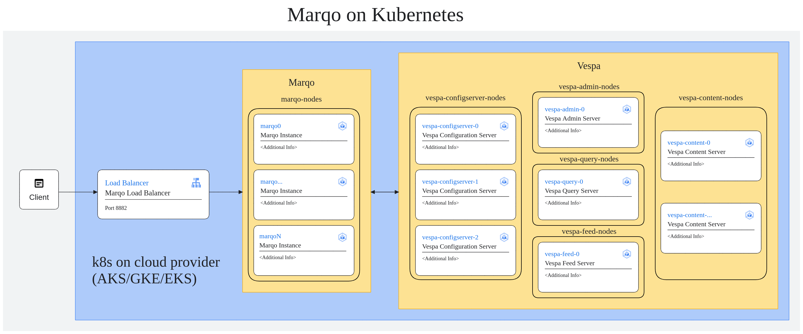

# Overview

Marqo redefines multimodal AI vector search by offering a powerful, all-in-one engine for both text and image processing, complete with inbuilt vector generation, storage, and retrieval based on tensor search.

It simplifies machine learning deployment and input transformations, ensuring seamless integration into your application. Embrace Marqo to elevate your AI and ML search capabilities with minimal effort and maximum efficiency.

For more information on Marqo, see the Marqo [official website](https://www.marqo.ai/).


## Architecture



This solution uses Vespa as the vector repository. For more information visit [official documentation](https://docs.marqo.ai/).


## Getting Started

To deploy Marqo on managed cloud services like Google Cloud Platform (GCP) and Azure, follow the step-by-step guides provided in the Installation files for each cloud provider.

### Requirements

- A GCP or Azure account.
- Basic understanding of Kubernetes and Helm.
- `kubectl` and `helm` installed on your local machine.

### Installation on Google Cloud

[Installation-GKE.md](Installation-GKE.md).

### Installation on Azure

[Installation-AKS.md](Installation-AKS.md).

## Next Steps

Once Marqo is installed, you can begin integrating it into your applications. See the `test_marqo.py` script for examples of how to interact with Marqo for search operations.

```
export MARQO_CLUSTER_IP=$(kubectl get svc marqo -o jsonpath='{.status.loadBalancer.ingress[0].ip}')

python3 -m venv .venv
source .venv/bin/activate
pip install marqo
python test_marqo.py
```


## Contributing

We welcome contributions! Please see `LICENSE` for how you can contribute to this project.

For a more comprehensive guide on Marqo and its capabilities, refer to our [documentation](https://docs.marqo.ai/).


